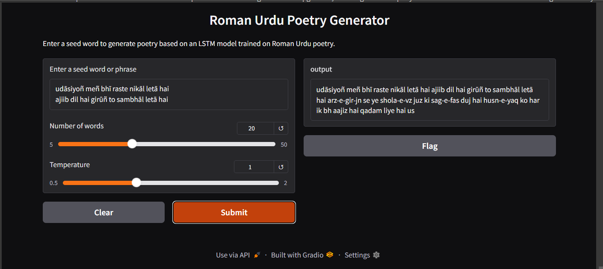

# 🌟 Roman Urdu Poetry Generator

## Overview
Ever wished for an AI poet that understands Roman Urdu? 🎨🌟 Introducing the **Roman Urdu Poetry Generator**—a project that blends AI with artistic expression! This tool uses deep learning and NLP to generate poetic verses based on user input, making AI an artist in its own right.

## ✨ Features
- 🔄 **Web Scraping**: Poetry data sourced from [Rekhta.org](http://rekhta.org/)
- 🧠 **LSTM Model**: Trained on Roman Urdu poetry for realistic text generation
- 📲 **Gradio UI**: Interactive and user-friendly web app
- 🛠️ **Deployment**: Hosted via Streamlit for public access

## 📚 Demo
Try out the poetry generator: **[Streamlit Deployment Link]** (Replace with actual link)

## 📚 Screenshot
Here's a preview of the app interface:



## 🛠 Installation
To run the project locally, follow these steps:

1. Clone the repository:
   ```bash
   git clone https://github.com/yourusername/roman-urdu-poetry-generator.git
   cd roman-urdu-poetry-generator
   ```

2. Install dependencies:
   ```bash
   pip install -r requirements.txt
   ```

3. Run the Gradio application:
   ```bash
   python app.py
   ```

## 📊 Dataset
- Scraped Roman Urdu poetry dataset from Rekhta.org.
- Preprocessed and cleaned for optimal model training.

## 🤖 Model
- **Architecture:** LSTM-based recurrent neural network
- **Training:** Model trained on structured poetry datasets
- **Parameters:** Tuned for high-quality text generation

## 🌐 Deployment
The AI model is integrated into a Gradio-powered web app and hosted via Streamlit. Users can enter a seed phrase, adjust the word count & creativity, and generate poetry in real-time.

## 🔄 How It Works
1. Enter a seed phrase in Roman Urdu.
2. Adjust the number of words and temperature for creativity.
3. Click **Submit** to generate poetry.
4. AI-crafted poetry appears instantly!

## ✨ Future Enhancements
- Expanding dataset for richer poetic responses.
- Fine-tuning with user feedback for better authenticity.
- Support for both **Roman Urdu & Nastaliq (Urdu script).**

## 👨‍👩‍👦 Contributing
Contributions are welcome! Feel free to submit issues or pull requests to improve the project.

## 📚 License
This project is licensed under the **MIT License**.

---
### 👥 Contact
For any questions, feel free to connect with me on [LinkedIn](https://www.linkedin.com/in/saadnadeem07/) or open an issue on GitHub.

Let’s see what poetic wonders AI can create! 🎨💭

